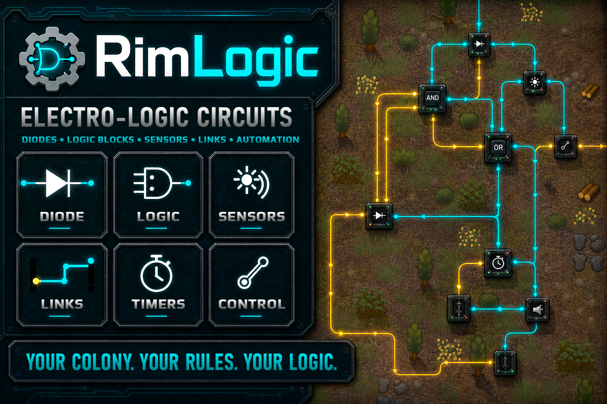

# RimLogic

*[Overview](README.md)*

**Electro-logic blocks for players who like their base to think for itself.**

`Version 1.1.6` · `RimWorld 1.6` · requires [Harmony](https://steamcommunity.com/sharedfiles/filedetails/?id=2009463077) · [Steam Workshop](https://steamcommunity.com/sharedfiles/filedetails/?id=3750951495)

# Changelog

## 1.1

### Added
- **Crafter block** — an automatic worker. It takes a colonist's place at a bench and works through that bench's queue. It can do anything a colonist could do at that bench, butchering and smelting included, and works at benches from other mods. Materials come from the chosen storage nearby, and finished goods go into the storage you pick. Its level is raised with resources: the higher it goes, the faster it works and the better the results.
- **Logic converter** — turns a plain signal into a number and back. It lets you catch a particular block state and turn it into a plain signal.
- **A shared status table** — blocks report over their signal what is happening to them, and spell the state out in words in the inspect pane.
- **Route points for links** — run a line where it suits you instead of straight across.
- **A full guide** in English and Russian: how the networks work, links, placing blocks side by side without wiring, every block explained, and worked example circuits.
- Block descriptions and button tooltips are fuller: they now explain not just what a block does, but what it is for.

### Fixed
- Link lines routed poorly, folding back on themselves instead of looping or going around.
- Consumer blocks all drew the same power regardless of their type.
- Notes in sensor windows were too small to read, and the room note did not match the sensor.
- Switching language in-game broke the mod's visuals: textures, icons and link lines.
- The selector behaved incorrectly: it is now always closed on one output and switches by signal.

## 1.0

### Added
- Initial release: electro-logic blocks (logic gates, sensors, generators, register, timer, memory, screen, clock, loudspeaker, diode, math block, multitool), signal links between blocks with map overlays, and power-grid interaction.
