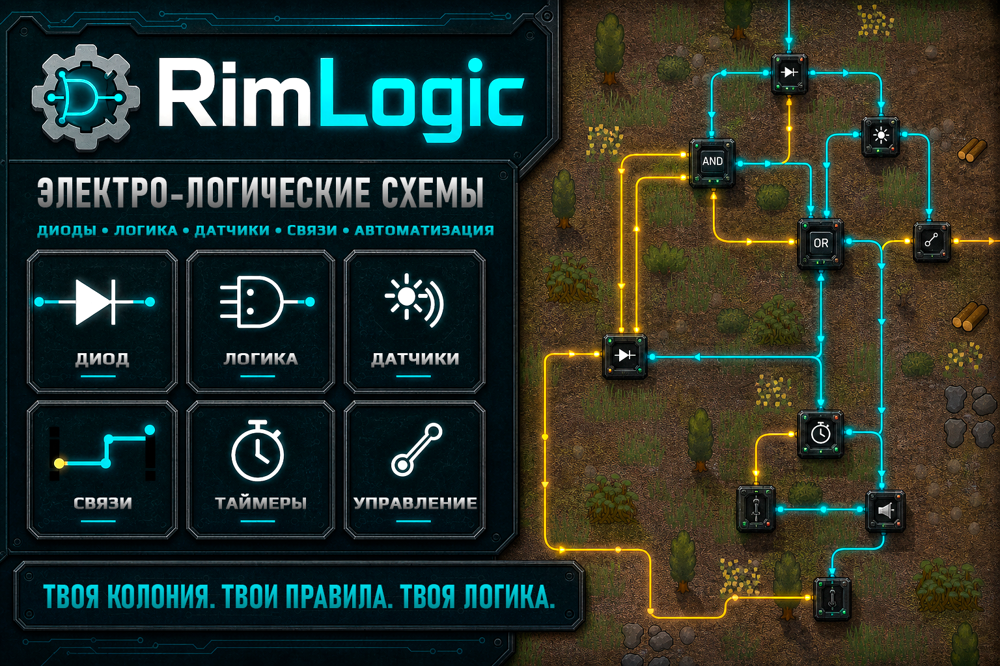

# RimLogic

*[Описание](README.ru.md)*

**Электро-логические блоки для тех, кто любит, когда база думает сама.**

`Version 1.1.8` · `RimWorld 1.6` · requires [Harmony](https://steamcommunity.com/sharedfiles/filedetails/?id=2009463077) · [Steam Workshop](https://steamcommunity.com/sharedfiles/filedetails/?id=3750951495)

# История изменений

## 1.1

### Добавлено
- **Блок-ремесленник** — автоматический работник. Ставится на рабочее место у верстака вместо колониста и выполняет его очередь заданий. Умеет всё, что умеет колонист за этим верстаком, включая разделку туш и переплавку, и работает с верстаками из других модов. Материалы берёт из выбранных складов рядом, готовое складывает в выбранные склады. Уровень повышается за ресурсы: чем выше, тем быстрее работа и лучше качество.
- **Логический преобразователь** — переводит обычный сигнал в число и обратно. Позволяет поймать нужное состояние блока и превратить его в простой сигнал.
- **Общая таблица состояний** — блоки сообщают по сигналу, что с ними происходит, и показывают состояние словами в панели осмотра.
- **Промежуточные точки маршрута связей** — линию можно провести там, где удобно, а не напрямик.
- **Полное руководство** на русском и английском: устройство сетей, связи, размещение блоков вплотную без проводов, разбор всех блоков и готовые схемы.
- Описания блоков и подсказки кнопок стали подробнее: теперь понятно не только что блок делает, но и зачем он нужен.

### Исправлено
- Блок-ремесленник мог подвесить игру при появлении механоидного кластера (требуется Royalty): генерация кластера не могла завершиться и съедала память.
- Линии связей строились неаккуратно: разворачивались сами на себя вместо петли или обхода.
- Блоки-потребители расходовали одинаковую энергию независимо от типа.
- Пояснения в окнах датчиков были нечитаемо мелкими, а текст про помещение не соответствовал датчику.
- Смена языка прямо в игре ломала отображение мода: текстуры, иконки и линии связей.
- Переключатель работал неверно: теперь он всегда замкнут на один выход и переключается по сигналу.

## 1.0

### Добавлено
- Первый выпуск: электрологические блоки (логика, датчики, генераторы, регистр, таймер, память, экран, часы, рупор, диод, математический блок, мультитул), связи между блоками с отображением на карте и работа с электросетью.
