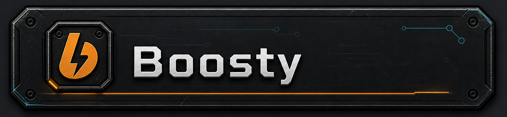

# RimLogic

*[Русская версия](README.ru.md)*

**Electro-logic blocks for players who like their base to think for itself.**

`Version 1.1.6` · `RimWorld 1.6` · requires [Harmony](https://steamcommunity.com/sharedfiles/filedetails/?id=2009463077) · [Steam Workshop](https://steamcommunity.com/sharedfiles/filedetails/?id=3750951495)

## Overview

RimLogic adds a system of electro-logic blocks for automating your RimWorld colony. It is made for those moments when simply flipping switches by hand is not enough, and you want to build an actual readable circuit: a sensor detects something, logic checks the condition, and the right block turns power on, changes state, shows a number, or sends a notification.

The mod includes signal links between blocks, normal interaction with the power grid, sensors, logic blocks, timers, memory, generators, screens, an alert speaker, and several functional utility blocks. Signal links can be shown directly on the map: colored lines make it clear which blocks are connected and where the signal is going. That becomes especially useful once a circuit grows beyond just two or three blocks.

With the diode, you can make power flow in only one direction. No more strange chains of switches when all you really need is a simple one-way power path. The diode makes those setups cleaner and easier to understand.

Neighbouring blocks need no wiring at all: stand them flush so one block's output faces the other's input, and the signal passes straight across. A whole circuit can be built as a simple chain, without drawing a single line.

Every block has its own settings menu.

## Blocks and what they do

### Sensors

- **Light sensor** — reacts to the current light level.
- **Motion sensor** — detects selected creature types in an area: colonists, animals, enemies, prisoners, and more.
- **Temperature sensor** — checks temperature against a chosen condition.
- **Power sensor** — monitors free energy in the grid or stored battery charge.
- **Pollution sensor** — reacts to pollution in an area.
- **Fire sensor** — triggers when there is fire nearby.

### Logic blocks

- **AND** — outputs a signal when all inputs are active.
- **OR** — outputs a signal when at least one input is active.
- **XOR** — outputs a signal when exactly one input is active.
- **NAND** — inverted AND.
- **NOR** — inverted OR.
- **XNOR** — inverted XOR.
- **Splitter** — copies one signal to several outputs.
- **Logic converter** — turns a plain signal into a number and back.

### Functional blocks

- **Switch** — a switch controlled by signals.
- **Selector** — switches power between two outputs.
- **Math block** — performs math operations and comparisons on numeric values.
- **Multitool** — a general-purpose block with several modes: counting items, pawns or harvest-ready crops, controlling doors and devices, and checking storage fullness.

### Generators, memory and output

- **Diode** — lets power pass in one direction only.
- **Signal generator** — a constant signal source.
- **Tick generator** — a periodic pulse.
- **Register** — changes state when it receives a signal.
- **Timer** — delays a signal.
- **Memory** — stores a numeric value.
- **Screen** — displays a digit; several screens can be used together to show a number.
- **Clock** — outputs a signal at a chosen time of day.
- **Speaker** — sends a custom notification on any signal.

### Production

- **Crafter block** — takes a colonist's place at a bench and works through its queue. Slower than a living crafter, but it never sleeps or wanders off.

## Usage examples

- Turn power on or off based on a condition.
- Build circuits with several sensors and logic conditions.
- Separate sections of the power grid with diodes.
- Display numeric values on screens.
- React to motion, temperature, light, available power, fire, or pollution.

## Installation

Install the mod through the Steam Workshop, or place the RimLogic folder manually into `RimWorld/Mods`.

Harmony must load before RimLogic.

## Compatibility

- RimWorld 1.6
- Requires Harmony
- Safe to add to an existing save
- Russian and English are supported
- Multiplayer is not supported

## Documentation

**[Full guide](DOCUMENTATION_en.md)** — how the logic and power networks work, links and route points, placing blocks side by side without wiring, every block and type explained, and worked example circuits.

[CHANGELOG](CHANGELOG.md)

## Support the author

If you enjoy RimLogic, you can support development:

**USDT (TRC20):** `TA4zq9F4TTrSQXjEESMBk8juQMGNLXX4B5`

Thank you! ❤️

